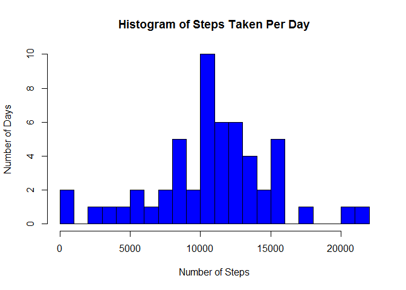
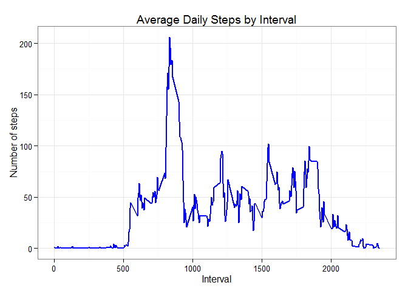
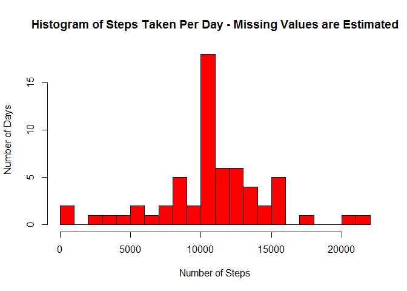
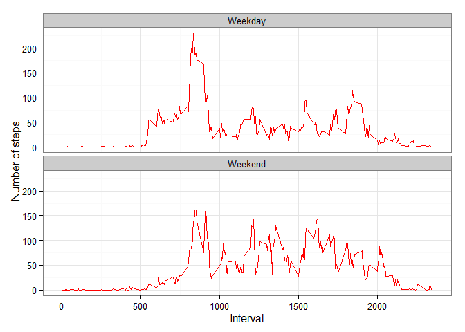

# Reproducible Research: Peer Assessment 1

Lee Bohan - 17th October 2015

## Loading and preprocessing the data

1. Show any code that is needed to

2. Load the data (i.e. read.csv())

Process/transform the data (if necessary) into a format suitable for your analysis

```r
library(plyr)
library(RColorBrewer)
library(ggplot2)
dat <- read.csv("activity.csv")
dat$date <- as.character(dat$date)
dat$date <- as.Date(dat$date,"%Y-%m-%d")
```


## What is mean total number of steps taken per day?

For this part of the assignment, you can ignore the missing values in the dataset.

1. Calculate the total number of steps taken per day

2. If you do not understand the difference between a histogram and a barplot, research the difference between them. Make a histogram of the total number of steps taken each day


```r
stepsPerDay <- ddply(dat, "date", summarize,Count=sum(steps))
hist(stepsPerDay$Count,breaks=25,col="blue", main="Histogram of Steps Taken Per Day",
     ylab="Number of Days",xlab="Number of Steps")
```

 

3. Calculate and report the mean and median of the total number of steps taken per day


```r
median(stepsPerDay$Count,na.rm=TRUE)
```

```
## [1] 10765
```

```r
mean(stepsPerDay$Count,na.rm=TRUE)
```

```
## [1] 10766.19
```

## What is the average daily activity pattern?

1. Make a time series plot (i.e. type = "l") of the 5-minute interval (x-axis) and the average number of steps taken, averaged across all days (y-axis)


```r
noNA <- complete.cases(dat)
stepsPerInt <- ddply(dat[noNA,], "interval", summarize,Ave=mean(steps))
ggplot(stepsPerInt, aes(x=interval, y=Ave)) +   
        geom_line(color="blue", size=1) +  
        labs(title="Average Daily Steps by Interval", x="Interval", y="Number of steps") +  
        theme_bw()
```

 

2. Which 5-minute interval, on average across all the days in the dataset, contains the maximum number of steps?


```r
stepsPerIntSorted <- arrange(stepsPerInt,desc(Ave))
stepsPerIntSorted[1,]
```

```
##   interval      Ave
## 1      835 206.1698
```


## Imputing missing values

Note that there are a number of days/intervals where there are missing values (coded as NA). The presence of missing days may introduce bias into some calculations or summaries of the data.

1. Calculate and report the total number of missing values in the dataset (i.e. the total number of rows with NAs)


```r
sum(is.na(dat$steps))
```

```
## [1] 2304
```

2. Devise a strategy for filling in all of the missing values in the dataset. The strategy does not need to be sophisticated. For example, you could use the mean/median for that day, or the mean for that 5-minute interval, etc.

*Use the mean for that time interval*

3. Create a new dataset that is equal to the original dataset but with the missing data filled in.


```r
newDat <- dat
for (i in 1:nrow(newDat)){
    if (is.na(newDat[i,1])){
        intAve <- subset(stepsPerInt,interval == newDat[i,3])
        newDat[i,1] <- intAve[2]
    }
}
```

4. Make a histogram of the total number of steps taken each day and Calculate and report the mean and median total number of steps taken per day. Do these values differ from the estimates from the first part of the assignment? 


```r
newStepsPerDay <- ddply(newDat, "date", summarize,Count=sum(steps))
hist(newStepsPerDay$Count,breaks=25,col="red", 
     main="Histogram of Steps Taken Per Day - Missing Values are Estimated",
     ylab="Number of Days",xlab="Number of Steps")
```

 


```r
median(newStepsPerDay$Count)
```

```
## [1] 10766.19
```

```r
mean(newStepsPerDay$Count)
```

```
## [1] 10766.19
```

The median is slightly different, the mean identical:

- Before estimating the missing data
    1. Mean  : *10766.19*
    2. Median: *10765*

- After estimating the missing data
    1. Mean  : *10766.19*
    2. Median: *10766.19*
    
    

5. What is the impact of imputing missing data on the estimates of the total daily number of steps?

*The mean value is unchanged*

*The median value changes slightly to match the median*

*The peak value on the histogram increases significantly but the basic shape of the distribution
remains the same*

## Are there differences in activity patterns between weekdays and weekends?

For this part the weekdays() function may be of some help here. Use the dataset with the filled-in missing values for this part.

1. Create a new factor variable in the dataset with two levels - "weekday" and "weekend" indicating whether a given date is a weekday or weekend day.


```r
dayTypes <- vector()
dayList <- weekdays(newDat$date)
dayListLogical <- dayList == "Saturday" | dayList == "Sunday"
dayTypes[dayListLogical] <- "Weekend"
dayTypes[!dayListLogical] <- "Weekday"
newDat$DType <- as.factor(dayTypes)
str(newDat)
```

```
## 'data.frame':	17568 obs. of  4 variables:
##  $ steps   : num  1.717 0.3396 0.1321 0.1509 0.0755 ...
##  $ date    : Date, format: "2012-10-01" "2012-10-01" ...
##  $ interval: int  0 5 10 15 20 25 30 35 40 45 ...
##  $ DType   : Factor w/ 2 levels "Weekday","Weekend": 1 1 1 1 1 1 1 1 1 1 ...
```

2. Make a panel plot containing a time series plot (i.e. type = "l") of the 5-minute interval (x-axis) and the average number of steps taken, averaged across all weekday days or weekend days (y-axis). See the README file in the GitHub repository to see an example of what this plot should look like using simulated data.


```r
newStepsPerInt <- ddply(newDat, c("interval","DType"), summarize,Ave=mean(steps))
ggplot(newStepsPerInt, aes(x=interval, y=Ave)) + 
        geom_line(color="red") + 
        facet_wrap(~ DType, nrow=2, ncol=1) +
        labs(x="Interval", y="Number of steps") +
        theme_bw()
```

 

###System and Version Details

Output HTML generated at *Sat Oct 17 13:44:40 2015*

*R version 3.2.2 (2015-08-14)*

